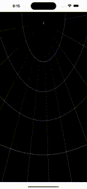

# panoramaI

A light weight panoramal viewer targeting IOS.

## Usage 

###  If 360 image is in Resources folder.
```
import panoramaI


struct ContentView: View {
        
    var body: some View {
        VStack{
            PanoramaI(name: "merged", ext: "jpg")-->
        }
    }
}

```

###  Load from url.
```
import panoramaI


struct ContentView: View {
        
    var body: some View {
        VStack{
            PanoramaI(urlPath: "https://url.com/360image.jpeg")-->
        }
    }
}

```


## Quick demo
### Paris

###
World view


 
